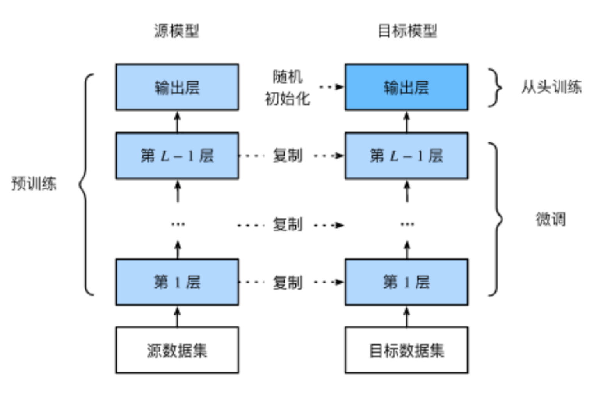

# CR
Context Reason 上下文

SOP Stander

TPH = 占用率*(3600/AHT)并发数

# ChatBot
GPT: ACTIOM-Acceptance {"key":value, "key":value}
System: Please confirm the type of .. candidates: ["1, pdp", "2, adawkad", "8. Other"] return with the key type.
GPT: ACTION-Acceptance {"........."}

# SFT
监督微调

在预训练模型的基础上，在目标数据集上进行微调

## LoRA
低秩适配 W0 = W + A * B
## P-Tuning
