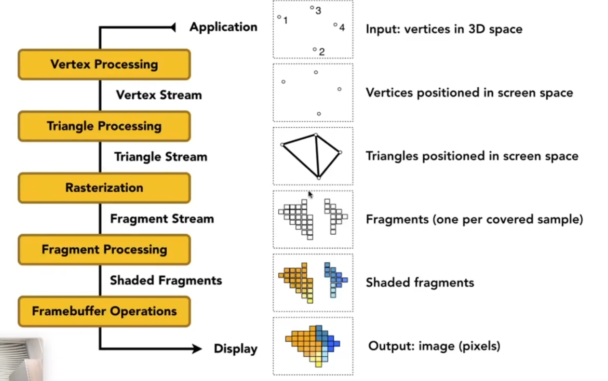

# 图形学入门

## 矩阵与变换

- model rotation
- viewing rotation

### Scale matrix

$$ S = \begin{bmatrix} s`  & 0 & 0 & 0 \\ 0 & s_y & 0 & 0 \\ 0 & 0 & s_z & 0 \\ 0 & 0 & 0 & 1 \end{bmatrix} $$
### reflection matrix

$$ R = \begin{bmatrix} -1 & 0 & 0 & 0 \\ 0 & 1 & 0 & 0 \\ 0 & 0 & 1 & 0 \\ 0 & 0 & 0 & 1 \end{bmatrix} $$

### rotation matrix

### 齐次坐标
2Dpoint $(x, y)$ => $(x, y, 1)$ 
把w归一化成1
$$ \begin{bmatrix} x \\ y \\ w \end{bmatrix}  => \begin{bmatrix} x/w \\ y/w \\ 1\end{bmatrix}$$

2Dvector $(x, y)$ => $(x, y, 0)$ v

## 三角形的光栅化

## 光栅化
 


### MSAA


## 深度检测

z-buffer 
在渲染时，对于每个像素，我们都会计算它的深度值，然后将这个深度值与深度缓冲区中的值进行比较，如果当前像素的深度值小于深度缓冲区中的值，那么我们就更新深度缓冲区中的值，并更新颜色缓冲区中的颜色值。 解决渲染先后顺序went

## Shading

blinn-phong model

漫反射项
$$ L = k_d(I/r^2)\max(0,n \cdot l) $$

- $ k_d $ : diffuse reflection coefficient， 可以理解为物体的颜色，材质
- $I$ : 光照强度
- $r$ : 距离
- $n$ : shading point 法向量
- $l$ : 光线方向


高光项
利用半程向量$h$和shadingpiont法向$n$近似替代了观察方向$v$和光线方向$l$，
$$ h = \frac{l+v}{||l+v||} $$
$$ L_s = k_s(I/r^2)\max(0,n \cdot h)^{\alpha} $$

- $k_s$ : specular reflection coefficient 高光的颜色
- $\alpha$ : shininess coefficient 高光的锐度, 加速cos的衰减速度，减少高光范围

环境光项
$$ L_a = k_aI_a $$

- $k_a$ : ambient reflection coefficient 环境光的颜色
- $I_a$ : ambient light intensity 环境光的强度 

不讲究从什么地方进入的光，只讲究光的强度，常数项


flat shading - 面着色
在每个面计算光照


Gouraud shading - 顶点着色
在每个顶点计算光照，然后插值


Phong shading - 像素着色
在每个像素计算光照


### shading pipeline

 

Fragments: 片元


## 纹理映射

uv坐标系
uv 范围是[0, 1]，对应于纹理的坐标系


## 杂货
### Bresenham’s Line Drawing Algorithm
布雷森汉画线算法

- 问题是为了解决如何在两点之间画一条直线而出现的。最基本的画线是计算斜率，然后for每个像素点直接计算出该点的y值。
- 因为浮点运算还是相对较慢，而布雷森汗可以将问题简化为整数和增量进行运算
- 假设我们画线永远是从左到右，斜率0 - 1
- 其余情况可以通过交换起止点及 x轴 y轴进行处理
```cpp
void line(int ax, int ay, int bx, int by, TGAImage &framebuffer, TGAColor coller){
    bool steep = std::abs(ax-bx) < std::abs(ay-by);
    if(steep){
        std::swap(ax, ay);
        std::swap(bx, by);
    }
    if(ax>bx){
        std::swap(ax,bx);
        std::swap(ay,by);
    }
    float y = ay;
    float ierror = 0;
    for(int x = ax; x <= bx; x++){
        if(steep){
            framebuffer.set(y, x, coller);
        } else {
            framebuffer.set(x, y, coller);
        }
        ierror += 2 * std::abs(by-ay);
        if(ierror > bx-ax){
            y += by > ay ? 1 : -1;
            ierror -= 2*(bx-ax);
        }
    }
}
```
核心思路是定义一个误差变量`ierror`，用于判断当前点是否需要向上或保持当前像素。
$$ierror=2*dx*(y_real - y_current )$$

- 真实线走到了 y_real，
- 当前像素线还停留在 y_current，
- ierror 就是这个偏差乘以 2 * dx 得到整数。

我们每走一步 x：

- 理想线 y_real 增加了 dy/dx
- 所以：

$$ierror+=2*dx*(dy/dx)=2*dy$$

每走一步 $x$，$y_real$ 增加了 $dy/dx$，所以误差 $ierror$ 增加 $2 * dy$

从定义：
$$ierror=2*dx*(y_real-y_current)$$
当 偏差大于0.5时，说明需要移动一个像素
$$y_real-y_curr|ent>0.5$$
$$ierror>2*dx*0.5$$

即当$$ierror>2*dx*0.5$$
说明需要移动一个像素

当y移动了一个像素时，则需要让偏差减去这个y移动所减少的误差

$$ierror=2*dx*((y_real-(y_current+1))) = \text{原来的误差}-2*dx$$

也就是需要
$$ierror -= 2*(bx-ax)$$

此时可以将$dx$ $dy$视为 $bx-ax$ 和 $by-ay$ 以获取到离散值
此时，完全没有浮点运算，完全是整数运算