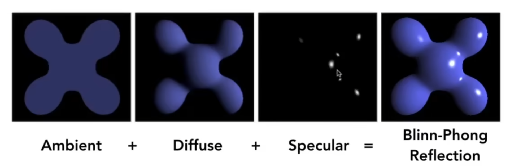

# 图形学入门

## 矩阵与变换

- model rotation
- viewing rotation

### Scale matrix

$$ S = \begin{bmatrix} s`  & 0 & 0 & 0 \\ 0 & s_y & 0 & 0 \\ 0 & 0 & s_z & 0 \\ 0 & 0 & 0 & 1 \end{bmatrix} $$
### reflection matrix

$$ R = \begin{bmatrix} -1 & 0 & 0 & 0 \\ 0 & 1 & 0 & 0 \\ 0 & 0 & 1 & 0 \\ 0 & 0 & 0 & 1 \end{bmatrix} $$

### rotation matrix

### 齐次坐标
2Dpoint $(x, y)$ => $(x, y, 1)$ 
把w归一化成1
$$ \begin{bmatrix} x \\ y \\ w \end{bmatrix}  => \begin{bmatrix} x/w \\ y/w \\ 1\end{bmatrix}$$

2Dvector $(x, y)$ => $(x, y, 0)$ v

## 三角形的光栅化

## 光栅化
 

### MSAA

## 深度检测

z-buffer 
在渲染时，对于每个像素，我们都会计算它的深度值，然后将这个深度值与深度缓冲区中的值进行比较，如果当前像素的深度值小于深度缓冲区中的值，那么我们就更新深度缓冲区中的值，并更新颜色缓冲区中的颜色值。 解决渲染先后顺序went

## Shading

blinn-phong model

漫反射项
$$ L = k_d(I/r^2)\max(0,n \cdot l) $$

- $ k_d $ : diffuse reflection coefficient， 可以理解为物体的颜色，材质
- $I$ : 光照强度
- $r$ : 距离
- $n$ : shading point 法向量
- $l$ : 光线方向

高光项
利用半程向量$h$和shadingpiont法向$n$近似替代了观察方向$v$和光线方向$l$，
$$ h = \frac{l+v}{||l+v||} $$
$$ L_s = k_s(I/r^2)\max(0,n \cdot h)^{\alpha} $$

- $k_s$ : specular reflection coefficient 高光的颜色
- $\alpha$ : shininess coefficient 高光的锐度, 加速cos的衰减速度，减少高光范围

环境光项
$$ L_a = k_aI_a $$

- $k_a$ : ambient reflection coefficient 环境光的颜色
- $I_a$ : ambient light intensity 环境光的强度 

不讲究从什么地方进入的光，只讲究光的强度，常数项

flat shading - 面着色
在每个面计算光照

Gouraud shading - 顶点着色
在每个顶点计算光照，然后插值

Phong shading - 像素着色
在每个像素计算光照